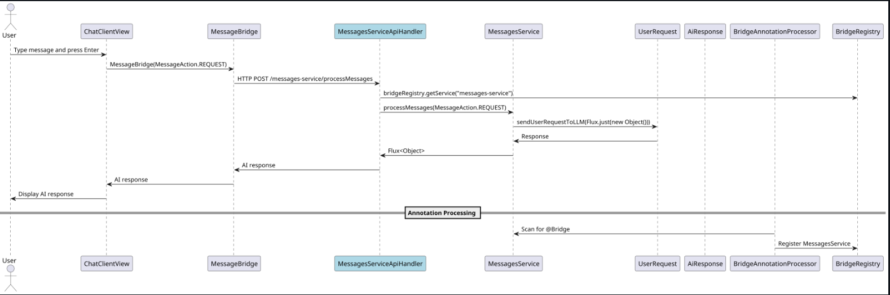
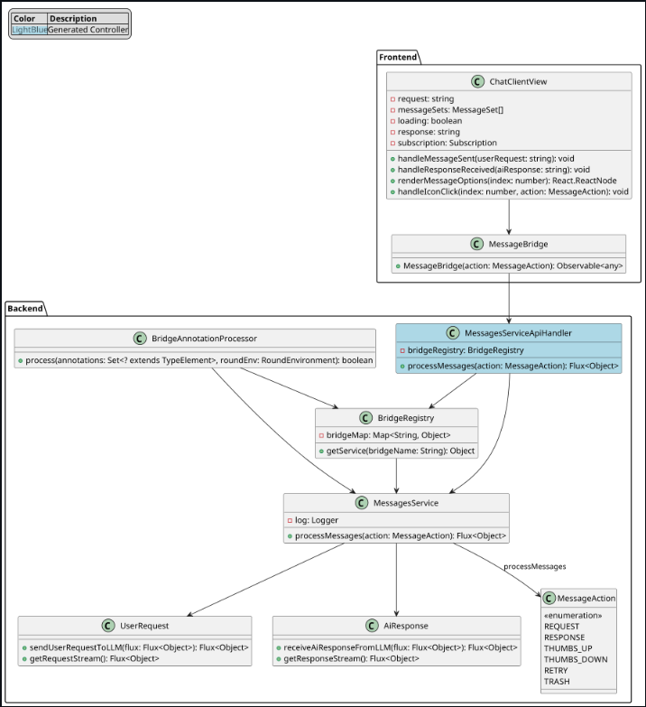

# ANNOTATIONS\_MODULE.md

## Overview

The `@Bridge` annotation is designed to facilitate seamless communication between front-end TypeScript 'bridge' classes and back-end services in a Spring Boot application. This annotation, when applied to a service class, enables automatic registration and mapping of the service, simplifying the process of exposing service methods as REST endpoints.

## Purpose

The primary purpose of the `@Bridge` annotation is to:

1. **Automate Service Registration**: Automatically register annotated services in the `BridgeRegistry`, which maintains a map of service names to service instances.
2. **Generate API Handlers**: Generate API handler classes that expose the service methods as REST endpoints, reducing boilerplate code and potential errors.
3. **Simplify Front-end Integration**: Provide a straightforward way for front-end applications to interact with back-end services through TypeScript 'bridge' classes.

## Benefits

### 1. Reduced Boilerplate Code

At the point of writing this, the framework has well over 20 front-end 
callable services. Multiply those by the number of actions each service
can perform and you have a lot of boilerplate code. I wrote essentially 3
java classes and 1 typescript class to handle all of that.
By using the `@Bridge` annotation, developers can avoid writing repetitive code for registering services and creating REST controllers. The `BridgeAnnotationProcessor` handles these tasks automatically.

### 2. Consistent API Exposure

The generated API handlers ensure that all services are exposed in a consistent manner, following the same conventions and patterns. This consistency makes it easier to maintain and extend the application.

### 3. Improved Maintainability

With the `@Bridge` annotation, changes to service classes are automatically reflected in the generated API handlers. This reduces the risk of discrepancies between the service implementation and its exposed API.

### 4. Enhanced Developer Productivity

Developers can focus on implementing business logic in their service classes without worrying about the underlying infrastructure for exposing these services as REST endpoints. This leads to faster development cycles and improved productivity.

## Sequence Diagram

The following sequence diagram illustrates the interaction between the front-end and back-end components when a user sends a message:



## Class Diagram

The class diagram below provides an overview of the key classes and their relationships in the system:



## Usage

To use the `@Bridge` annotation, follow these steps:

1. **Annotate your service class with `@Bridge("service-name")` and implement the `processMessages` method** (step 1):
    ```java
    @Bridge("messages-service")
    public class MessagesService implements MessagesIface {
        // Service implementation

        @Override
        public Flux<Object> processMessages(MessageActions action) {
            Flux<Object> flux;
            try {
                flux = switch (action) {
                    case REQUEST -> UserRequest.sendUserRequestToLLM(Flux.just(new Object()));
                    case RESPONSE -> AiResponse.receiveAiResponseFromLLM(Flux.just(new Object()));
                    case THUMBS_UP -> ThumbsUp.processThumbsUp(Flux.just(new Object()));
                    case THUMBS_DOWN -> ThumbsDown.processThumbsDown(Flux.just(new Object()));
                    case RETRY -> RetryMessage.retryMessageSet(Flux.just(new Object().toString()));
                    case TRASH -> TrashMessageSet.destroyMessageSet(Flux.just(new Object()));
                };
            } catch (Exception messagesServiceExc) {
                log.error("{}: Error from MessagesService performing action:", action, messagesServiceExc);
                return Flux.empty();
            } finally {
                log.info("MessagesService action completed: {}", action);
            }
            return flux;
        }
    }
    ```

2. **Create the TypeScript bridge(note we have matching action enum here 
   as well). import the connectionFactory** (step 2):
    ```typescript
    import { from, Observable } from "rxjs";
    import { map } from "rxjs/operators";
   //(1)
    import client from "./ConnectionFactory";
   //(matching action enum. in bolth the front and back end)
    import { MessageActions } from "../enums/MessageActions";

   //matches the @Bridge("messages-service") in the back end
    const SERVICE = "messages-service";

    /**
     * <h1>{@link MessageBridge}</h1>
     * @param action MessageActions
     * @constructor MessageBridge
     */
    export const MessageBridge = (action: MessageActions): Observable<any> => {
        return from(
            client.call(
   //client.call is a method that makes a post request to the server
                SERVICE,
   //SERVICE is the name of the service
                "processMessages",
   //action is the parameter(enum)
                { action })
        ).pipe(map(response => response));
    };
    ```

3. **The `BridgeAnnotationProcessor` will generate the necessary API 
    handler classes**:
    ```java
    @RestController
    @RequestMapping("/messages-service")
    public class MessagesServiceApiHandler {

        private final BridgeRegistry bridgeRegistry;

        public MessagesServiceApiHandler(BridgeRegistry bridgeRegistry) {
            this.bridgeRegistry = bridgeRegistry;
        }

        @PostMapping("/processMessages")
        public Flux<Object> processMessages(@RequestBody MessageActions action) {
            MessagesService service = (MessagesService) bridgeRegistry.getService("messages-service");
            return service.processMessages(action);
        }
    }
    ```
