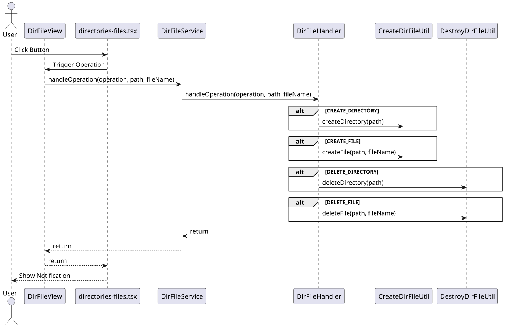

# Directories Module

This module provides services and utilities for managing directories and files. It includes functionality for creating and deleting directories and files, as well as handling these operations through a backend service.

## Files Overview

### `DirFileService.java`
- **Location:** `directories-mod/src/main/java/org/dacss/projectinitai/directories/services/DirFileService.java`
- **Description:** This class is a backend Hilla endpoint service for directories and files.
- It provides methods to handle operations such as creating and deleting directories and files by calling the `DirFileHandler`.

### `DirFileHandler.java`
- **Location:** `directories-mod/src/main/java/org/dacss/projectinitai/directories/handlers/DirFileHandler.java`
- **Description:** This class handles the actual operations for directories and files.
- It includes methods to create and delete directories and files, utilizing utility classes for these operations.

### `CreateDirFileUtil.java`
- **Location:** `directories-mod/src/main/java/org/dacss/projectinitai/directories/utilities/CreateDirFileUtil.java`
- **Description:** This utility class provides static methods for creating directories and files.
- It includes logging for successful and failed operations.

### `DestroyDirFileUtil.java`
- **Location:** `directories-mod/src/main/java/org/dacss/projectinitai/directories/utilities/DestroyDirFileUtil.java`
- **Description:** This utility class provides static methods for deleting directories and files. 
- It includes recursive deletion for directories and logging for successful and failed operations.

### `directories-files.tsx`
- **Location:** `frontend-mod/src/main/frontend/views/directories-files.tsx`
- **Description:** This React component provides a user interface for managing directories and files. 
- It includes text fields for inputting paths and file names, and buttons for triggering create and delete operations. It uses the `DirFileService` to handle these operations.

### `model-destroy.tsx`
- **Location:** `frontend-mod/src/main/frontend/views/model-destroy.tsx`
- **Description:** This React component provides a user interface for deleting models. 
- It includes a text field for inputting the model path and a button for triggering the delete operation. It uses the `DeleteModelService` to handle the deletion.

### `custom-textfields.tsx`
- **Location:** `frontend-mod/src/main/frontend/views/custom-textfields.tsx`
- **Description:** This React component provides custom text fields with various properties such as labels, helper texts, placeholders, and tooltips. 
- It is used in the `directories-files.tsx` component to render specific text fields for directory and file paths.

## Sequence Diagram

