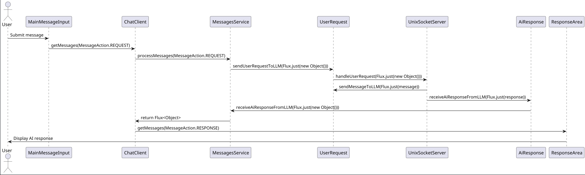

## messages-mod

## Front-end
### src/main/frontend/views/components/main-message-input.tsx
This file defines the MainMessageInput component, which is responsible for handling user input and sending user requests to the backend. It uses the MessageInput component from Vaadin and calls the MessagesService to process the user request.

### src/main/frontend/views/chat-client.tsx
This file defines the ChatClientView component, which serves as the main view for the chat client. It includes the MainMessageListArea component to display the conversation and the MainMessageInput component as a footer for user input.

### src/main/frontend/views/components/response-area.tsx
This file defines the ResponseArea component, which is responsible for handling and displaying the AI response. It subscribes to the response from the MessagesService and updates the state accordingly.

### src/main/frontend/views/main-message-list.tsx
This file defines the MainMessageListArea component, which manages the display of user and AI messages. It maintains the state of message sets, handles user requests, and AI responses, and includes options for each message (e.g., thumbs up/down, trash, retry).

## Back-end
### src/main/java/org/dacss/projectinitai/services/MessagesService.java
This file defines the MessagesService class, which is a backend service for processing different types of messages (e.g., user requests, AI responses, thumbs up/down, trash, retry). It uses various utility classes to handle these actions and logs the results.

### src/main/java/org/dacss/projectinitai/messages/utilities/UserRequestUtil.java
This file defines the UserRequestUtil class, which is a utility class to handle sending user request messages to an LLM reactively.

### src/main/java/org/dacss/projectinitai/messages/utilities/TrashMessageSetUtil.java
This file defines the TrashMessageSetUtil class, which is a utility class to destroy a message set (1 request + 1 response) from the database.

### src/main/java/org/dacss/projectinitai/messages/utilities/ThumbsUpUtil.java
This file defines the ThumbsUpUtil class, which is a utility class to handle thumbs up (saves the message as a set) to be used for positive reinforcement in the database.

### src/main/java/org/dacss/projectinitai/messages/utilities/ThumbsDownUtil.java
This file defines the ThumbsDownUtil class, which is a utility class to handle thumbs down (saves the message as a set) to be used for negative reinforcement in the database.

### src/main/java/org/dacss/projectinitai/messages/utilities/RetryMessageUtil.java
This file defines the RetryMessageUtil class, which is a utility class to retry a user's request via the retry clickable icon. This will prompt the Admin to reprocess the user request, as well as the AI to reprocess the user request.

### src/main/java/org/dacss/projectinitai/messages/utilities/AiResponseUtil.java
This file defines the AiResponseUtil class, which is a utility class to handle AI response messages from an LLM reactively.

