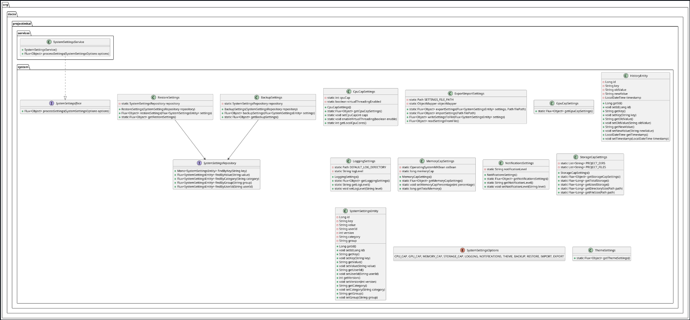
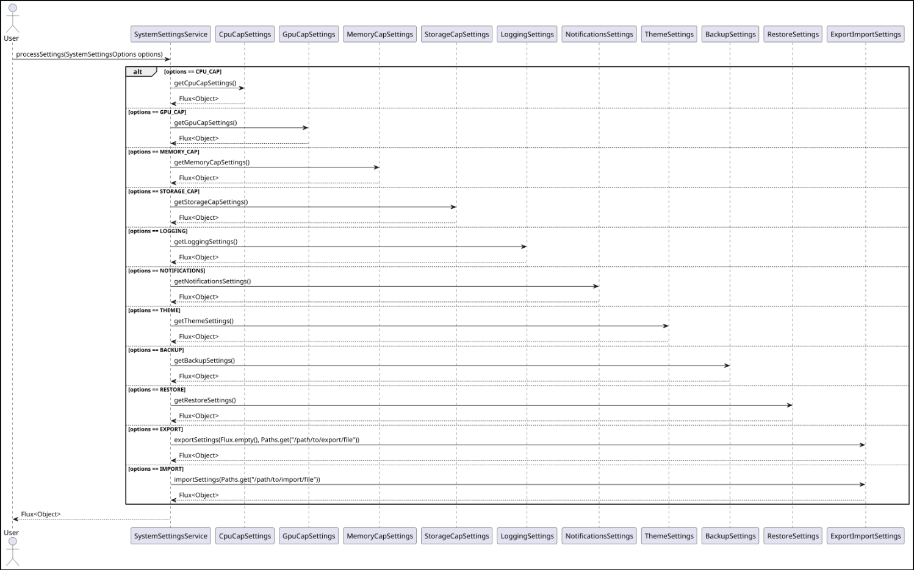

# Project Initialization AI System Settings Module

This module provides various system settings functionalities for the Project Initialization AI framework. Below is a brief description of each referenced file in this module.

## Files

### `BackupSettings.java`
This class provides methods to backup and restore system settings.

### `CpuCapSettings.java`
This class is used to get CPU stats and set a cap on the CPU usage for the framework. It defaults to the number of cores on the machine.

### `ExportImportSettings.java`
This class provides methods to export and import system settings.

### `GpuCapSettings.java`
This class is used to get GPU stats and set a total percentage cap for the framework to avoid starving the system.

### `HistoryEntity.java`
An entity class that represents a history of changes to system settings.

### `LoggingSettings.java`
This class provides the functionality to get and set the logging settings.

### `MemoryCapSettings.java`
This class is used to get memory stats and set a cap on the memory usage for the framework.

### `NotificationsSettings.java`
This class queries and sets the notifications pop-ups setting levels of the framework.

### `RestoreSettings.java`
This class provides methods to restore system settings.

### `StorageCapSettings.java`
This class provides methods to query and cap the storage capacity of the framework.

### `SystemSettingsEntity.java`
An entity class that represents a system setting.

### `SystemSettingsIface.java`
A functional interface to process system settings requests.

### `SystemSettingsOptions.java`
An enum for system settings options.

### `SystemSettingsRepository.java`
A repository interface that extends `ReactiveCrudRepository` for the `SystemSettingsEntity`.

### `ThemeSettings.java`
This class queries and sets the theme settings of the framework.

### `SystemSettingsService.java`
A backend Hilla endpoint service for system settings operations.

## Diagrams
- 
- 
